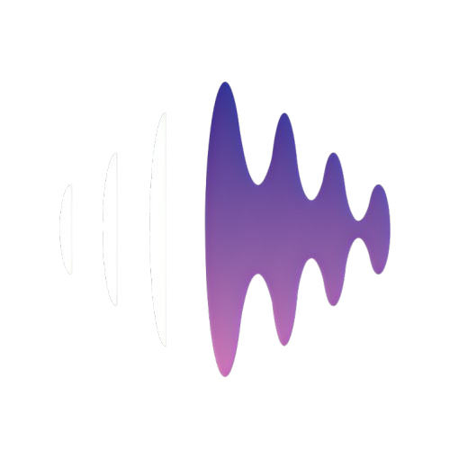

<div align="center">



# Pulse

**A premium, self-hosted music streaming app — powered by YouTube Music.**

[](LICENSE)
[](https://nodejs.org)
[](https://react.dev)
[](https://web.dev/progressive-web-apps/)

[Features](#-features) · [Screenshots](#-screenshots) · [Getting Started](#-getting-started) · [Configuration](#-configuration) · [Deployment](#-deployment)

</div>

---

## ✨ Features

### 🎵 Playback
- Stream 100M+ songs from YouTube Music — no ads, no limits
- **True Gapless Crossfade** between tracks with configurable fade duration using Web Audio API GainNodes
- Smooth dual-audio element system for precision volume-ramping transitions
- Gapless queue management with shuffle and repeat modes
- **Lock screen controls** (Media Session API) — play, pause, skip from your OS notification shade
- Full seek bar with live progress and duration

### 📚 Library & Playlists
- Create, edit, and organize personal playlists
- Import playlists directly from **Spotify** (by pasting a Spotify URL)
- Like songs and build a personal collection
- Import tracks individually or in bulk from YouTube Music search

### 🔍 Discovery
- Full YouTube Music search (songs, artists, albums)
- Artist pages with top tracks and biography
- "Related / Watch Next" auto-queue
- Personalized homepage with trending and recommendations

### 📥 Offline Downloads
- Download any song for offline playback (stored in browser IndexedDB)
- Manage downloads in a dedicated Downloads tab (grid / list view)
- Downloaded songs play instantly without a network request

### 🎤 Lyrics
- Synced & unsynced lyrics via LRCLib (primary)
- Fallback to Musixmatch and Genius
- Scrolling karaoke-style display in the full-screen player

### 🎨 Customization
- **Custom accent color** — pick any color, applied globally across the UI
- Crossfade duration slider (0–12 seconds)
- Download quality selector (high / medium / low)
- Dark glassmorphism UI throughout

### 📱 PWA — Install Like a Native App
- Add to home screen on Android, iOS & Desktop
- Offline shell with cached assets
- Lock screen / notification controls
- Background playback continues when you switch apps

---

## 🖼 Screenshots

> *Coming soon — add screenshots to `/docs/screenshots/` and link them here.*

---

## 🚀 Getting Started

### Prerequisites

| Tool | Min Version | Notes |
|------|-------------|-------|
| Node.js | 20+ | `node --version` |
| npm | 9+ | Ships with Node |
| Firebase project | — | For auth + Firestore |

### 1. Clone the repo

```bash
git clone https://github.com/its-ashutosh-pathak/Pulse.git
cd Pulse
```

### 2. Backend setup

```bash
cd backend
npm install
cp .env.example .env
```

Edit `.env` with your credentials (see [Configuration](#-configuration) below), then:

```bash
npm run dev
# Backend starts on http://localhost:5000
```

### 3. Frontend setup

```bash
cd frontend
npm install
npm run dev
# Frontend starts on http://localhost:5173
```

Open **http://localhost:5173** in your browser and log in with your Firebase account.

---

## ⚙️ Configuration

All secrets live in `backend/.env`. Copy the example file and fill in your values:

```bash
cp backend/.env.example backend/.env
```

| Variable | Required | Description |
|----------|----------|-------------|
| `FIREBASE_PROJECT_ID` | ✅ | Firebase project ID |
| `FIREBASE_CLIENT_EMAIL` | ✅ | Firebase Admin SDK service account email |
| `FIREBASE_PRIVATE_KEY` | ✅ | Firebase Admin SDK private key (keep the `\n` newlines) |
| `PORT` | — | Backend port (default: `5000`) |
| `NODE_ENV` | — | `development` or `production` |
| `FRONTEND_URL` | ✅ | Your frontend URL (for CORS) — e.g. `http://localhost:5173` |
| `SPOTIFY_CLIENT_ID` | Optional | For Spotify playlist import |
| `SPOTIFY_CLIENT_SECRET` | Optional | For Spotify playlist import |
| `MUSIXMATCH_API_KEY` | Optional | Lyrics fallback |
| `GENIUS_ACCESS_TOKEN` | Optional | Lyrics fallback |

> ⚠️ **Never commit your `.env` file.** It is listed in `.gitignore`. Only `.env.example` (with placeholder values) is committed.

### Firebase Setup

1. Go to [Firebase Console](https://console.firebase.google.com) → Create project
2. Enable **Authentication** → Sign-in method → **Google**
3. Enable **Firestore Database** → Start in production mode
4. Go to Project Settings → **Service Accounts** → Generate new private key
5. Copy `project_id`, `client_email`, and `private_key` into your `.env`

### Spotify Setup (Optional — for playlist import)

1. Go to [Spotify Developer Dashboard](https://developer.spotify.com/dashboard)
2. **Create app** → fill in any name, set Redirect URI to your frontend URL
3. Copy **Client ID** and **Client Secret** into your `.env`

---

## 🗂 Project Structure

```
Pulse/
├── backend/                  # Node.js + Express API
│   ├── src/
│   │   ├── app.js            # Express app + middleware + routes
│   │   ├── cache/            # In-memory TTL cache
│   │   ├── config/           # env.js, constants.js
│   │   ├── controllers/      # Request handlers
│   │   ├── external/         # YouTube Music, Piped, Spotify, Genius integrations
│   │   ├── middleware/       # auth, rateLimiter, errorHandler
│   │   ├── repositories/     # Firestore data access layer
│   │   ├── routes/           # Express routers
│   │   ├── services/         # Business logic
│   │   └── utils/            # logger, normalize, similarity, validate
│   ├── index.js              # Entry point
│   └── .env.example          # Environment variable template
│
└── frontend/                 # React 18 + Vite SPA
    ├── public/
    │   ├── offline.html      # PWA offline fallback
    │   └── pwa-*.png         # App icons
    ├── src/
    │   ├── assets/           # Static assets (logo)
    │   ├── components/       # Shared UI components
    │   ├── context/          # React Context (Audio, Auth, Playlist)
    │   ├── pages/            # Route-level page components
    │   └── utils/            # downloadManager, getHighResThumb
    └── vite.config.js        # Vite + PWA config
```

---

## ☁️ Deployment

The app is split into two independently deployable services.

### Backend — Railway / Render / Fly.io

1. Connect your GitHub repo to [Railway](https://railway.app) or [Render](https://render.com)
2. Set the **root directory** to `backend`
3. Set **start command**: `node index.js`
4. Add all environment variables from `.env` in the platform dashboard
5. Note the deployed backend URL (e.g. `https://pulse-api.railway.app`)

### Frontend — Vercel / Netlify

1. Connect your GitHub repo to [Vercel](https://vercel.com) or [Netlify](https://netlify.com)
2. Set **root directory** to `frontend`
3. Set **build command**: `npm run build`
4. Set **output directory**: `dist`
5. Add environment variable: `VITE_API_URL=https://your-backend-url.railway.app`

### Hugging Face Deployment (Advanced)

Pulse backend can be run entirely free on Hugging Face Spaces using a Docker template. The repository is designed for a subtree split workflow:
```bash
git subtree split --prefix backend main
git push hf <COMMIT_SHA>:refs/heads/main --force
```

> After deploying, update `FRONTEND_URL` in the backend env and add your frontend URL to the Spotify app's Redirect URIs.

---

## 🔧 Tech Stack

### Backend
- **Express.js** — REST API
- **Firebase Admin SDK** — Authentication + Firestore
- **youtubei.js** (Innertube) — YouTube Music metadata and search
- **Multi-tier Stream Extraction Engine** — dynamically attempts `yt-dlp` (bypasses cloud locks via cookie rotation), `Piped API` (bypasses via external CDN), and `Innertube` stream endpoints to guarantee reliable high-quality playback.
- **LRCLib / Genius** — Synced lyrics fetching and caching

### Frontend
- **React 19** + **Vite**
- **React Router v7** — Client-side routing
- **Web Audio API** — High-performance audio engine bypassing traditional HTML5 audio limitations for gapless crossfades
- **IndexedDB** — Offline song and lyrics metadata storage
- **Media Session API** — OS lock screen controls
- **vite-plugin-pwa** — PWA manifest + Workbox service worker
- Vanilla CSS with CSS custom properties (no Tailwind)

---

## 📄 License

MIT © [Ashutosh Pathak](https://github.com/its-ashutosh-pathak)

---

<div align="center">
  <sub>Built with ♥ for music lovers who value privacy and ownership.</sub>
</div>
