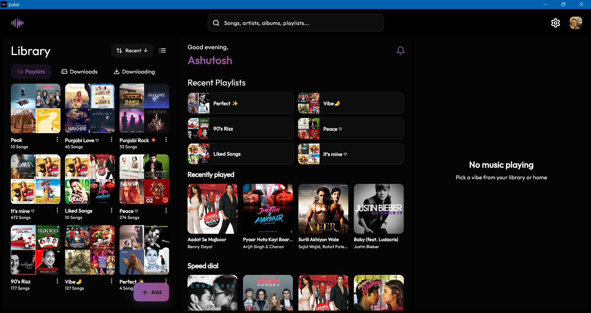
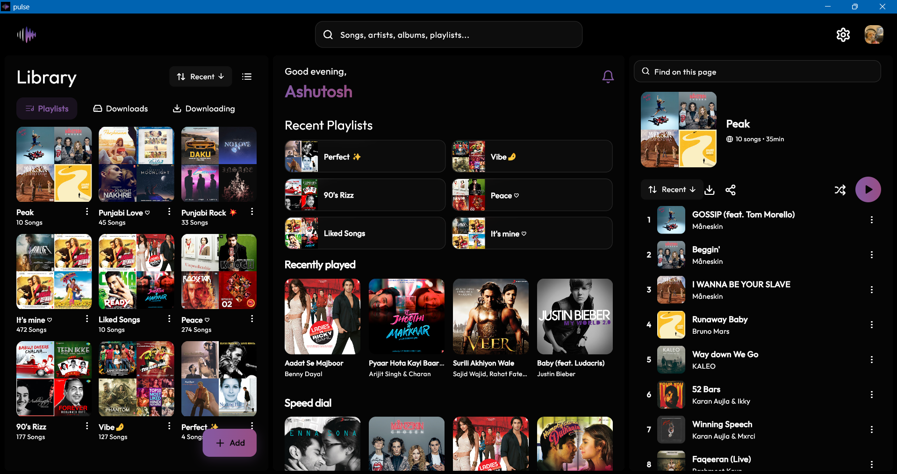
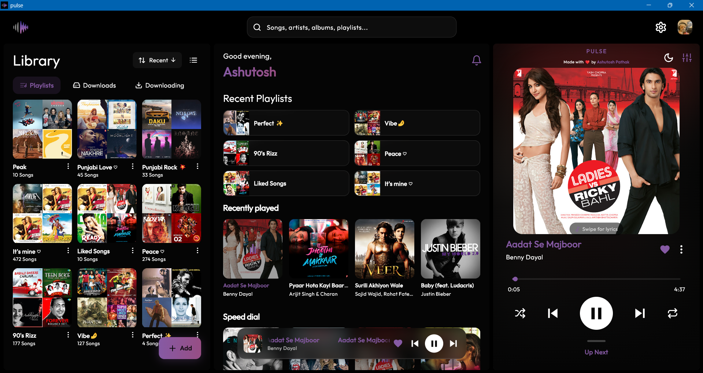
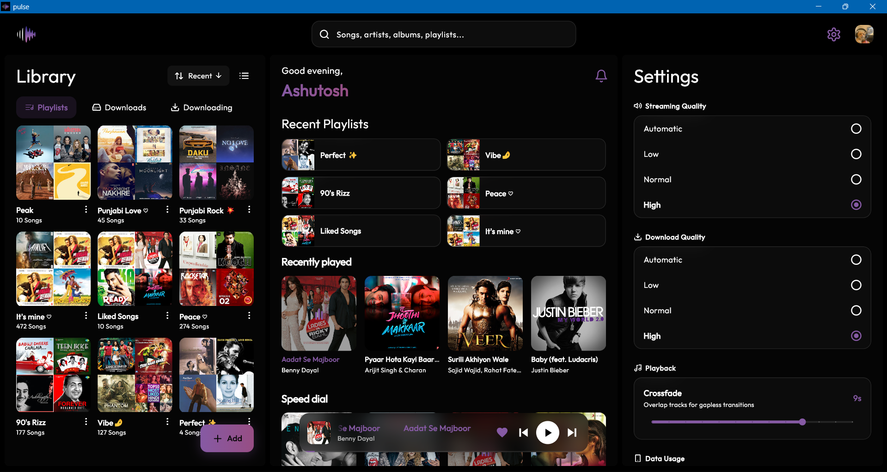
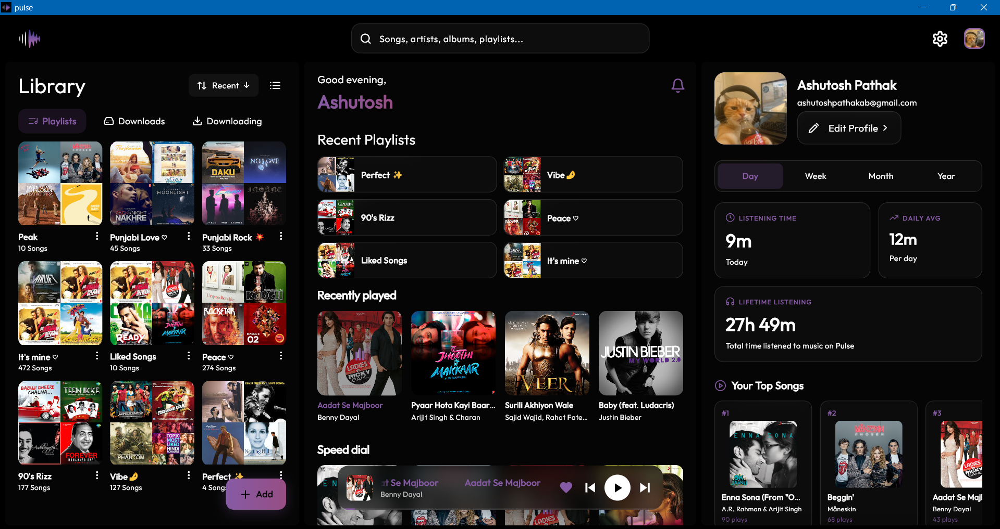
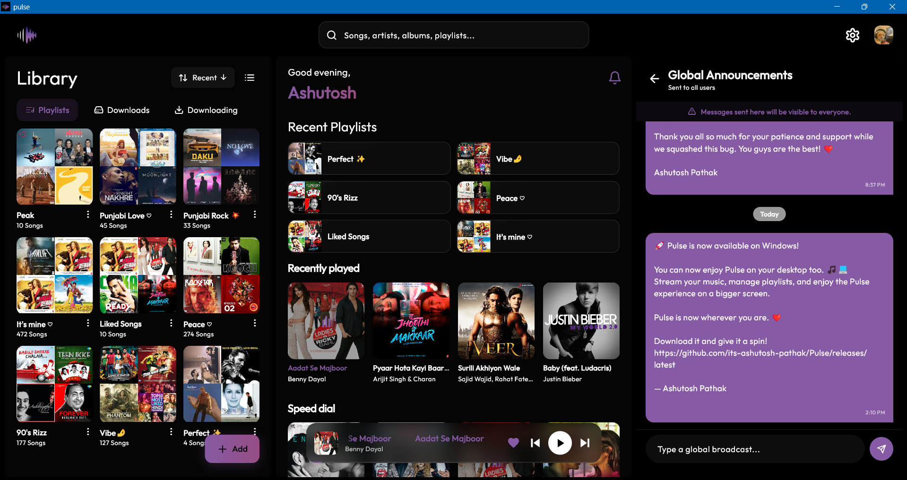
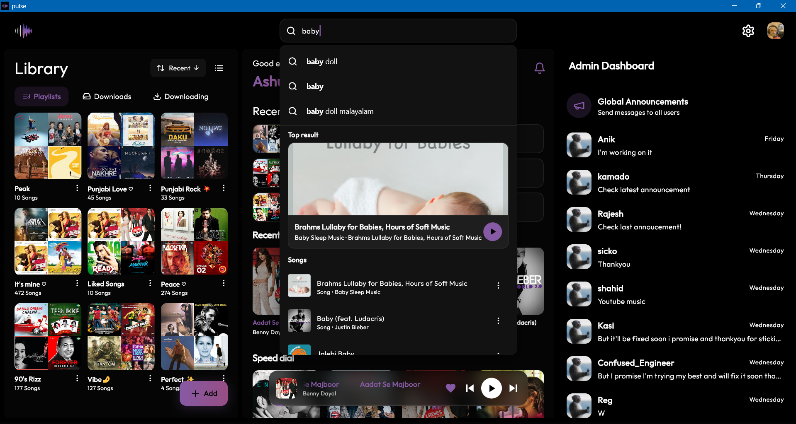

<p align="center">
  
</p>

# Pulse

*An open-source, premium music streaming client built with Flutter.*

<p align="left">
  
  
  
  
  
  
  
</p>

Pulse is an open-source Android music client that brings together a massive catalog of tracks with the personalized, synced experience of a premium app. Built with Flutter, it offers a seamless, immersive listening experience with features like background playback, crossfading, offline caching, cloud synchronization, and native audio recognition.

The name "Pulse" reflects its core philosophy: an alive, dynamic, and responsive music listening experience that feels modern, fluid, and meticulously designed.

<details>
<summary><b>📖 Table of Contents</b></summary>

- [Why Pulse?](#why-pulse)
- [📸 Screenshots](#-screenshots)
- [🚀 Key Features](#-key-features)
- [⚙️ How it Works](#️-how-it-works)
- [🛠️ Tech Stack](#️-tech-stack)
- [📁 Project Structure](#-project-structure)
- [🚀 Getting Started](#-getting-started)
- [🤝 Contributing](#-contributing)
- [🙌 Acknowledgements](#-acknowledgements)
- [⚠️ Disclaimer](#️-disclaimer)
- [📄 License](#-license)

</details>

### Why Pulse?
- 🌍 **Massive Catalog** — Access a vast library for streaming, including rare tracks, live performances, covers, and remixes.
- 🎧 **Premium Listening Experience** — Stream high-quality audio uninterrupted in the background without any ads.
- 🔄 **Cross-device Syncing** — Sign in with your Gmail account to securely sync your liked songs, custom playlists, recently played history, and listening stats across all your devices using Firebase.
- ✨ **Uncompromised Aesthetics** — Built with modern design principles: glassmorphism, dynamic accent colors, smooth micro-animations, and a completely clutter-free environment.
- 🌐 **Global Support** — Fully localized and translated into 30 different languages to serve users worldwide.
## 📸 Screenshots

<p align="center">
  
  
  
  
</p>
<p align="center">
  
  
  
  
</p>
<p align="center">
  
  
  
  
</p>
<p align="center">
  
  
</p>

### 💻 Desktop Client

<p align="center">
  
  
</p>
<p align="center">
  
  
</p>
<p align="center">
  
  
</p>
<p align="center">
  
</p>

## 🚀 Key Features

### Audio & Playback
- ✨ **Advanced Audio Engine:** High-quality playback powered by `media_kit` and `audio_service`, featuring seamless background play, native lock screen controls, and gapless playback.
- ✨ **Custom Crossfade Engine:** Smooth, DJ-style transitions between tracks via a bespoke crossfade implementation.
- ✨ **Live Lyrics:** Real-time synced lyrics powered by **LRCLIB**, featuring a custom fallback mechanism to handle messy metadata.
- ✨ **Network Dropout Resilience:** Automatically skips unplayable tracks without freezing the app when losing signal.

### Discovery & Library Management
- ✨ **Audio Recognition:** Instantly identify songs playing around you using the device microphone. Powered by a high-performance native **Rust** backend (`flutter_rust_bridge`).
- ✨ **Voice Search:** Hands-free, snappy voice searching with optimized speech-to-text integration.
- ✨ **Advanced Playlist Integration:** Seamlessly import your custom playlists directly from your favorite platforms. Features a dedicated UI for selecting which playlists to migrate.
- ✨ **Modern Library Layout:** Smooth, tabbed layout with interactive swiping for organizing Playlists, Downloads, and active Downloading queues.

### Offline Capabilities
- ✅ **Robust Offline Caching:** Cache your favorite tracks and lyrics locally for 100% offline listening using local storage (`sqflite`). Features auto-healing and smart retries for reliable, uninterrupted caching.
- ✅ **Dynamic Collages:** Auto-generated 4-cover art collages for offline playlists.

### Social & Personalization
- ✨ **Listening Stats & Analytics:** Keep track of your music habits year-round. Pulse actively tracks your total listening time (lifetime and daily average), top artists, and top songs, syncing securely to your profile.
- ✨ **Personalized Home Feed:** A dynamic, locally-synced home screen that automatically adapts to your listening history with custom "Speed Dial" and "Recently Played" rows.
- ✨ **Custom Accent Colors:** Fully personalize your experience by selecting a custom accent color theme that perfectly matches your vibe.
- ✨ **In-App Communication System:** Built-in broadcast and chat screens for receiving announcements and updates directly from the admin team.

### UI / UX
- ✨ **Glassmorphic Design:** A sleek, dark-themed user interface utilizing Material Design, glassmorphic player elements (`GlassContainer`), dynamic accent colors extracted from album art, and immersive system UI overlays.
- ✨ **Rich Interactive Elements:** Features animated audio bars (`PlayingBars`), marquee text in the `MiniPlayer`, and elegant bottom sheets for multi-artist tracks and song actions.

### Architecture & System
- ✅ **Over-The-Air (OTA) Updates:** Built-in update provider that checks Firebase for new app releases and seamlessly prompts the user to upgrade.
- ✅ **Cloud Synchronization:** Bi-directional syncing of your playlists, favorites, and settings across devices using Firebase Firestore and Authentication.

## ⚙️ How it Works

**Authentication & Sync**
By logging in with Gmail, your personal library data is synced to a secure Firebase Firestore backend. Pulse employs a local-first caching strategy (via SQLite) so you have instant access to your library even when offline or in airplane mode. Background workers handle uploading changes (like adding a song to a playlist or liking a track) seamlessly when a connection is restored.

**Streaming Pipeline**
Pulse utilizes a robust and highly optimized streaming engine designed to deliver fast, high-quality audio. Audio playback is handled by `media_kit` and `audio_service`, ensuring rock-solid background performance, buffering wake-locks (`wakelock_plus`) to prevent Android from killing the app, and gapless playback.

**Native Audio Processing**
Pulse integrates a native Rust backend (via `flutter_rust_bridge`) to perform high-performance audio tasks, such as generating audio signatures for song recognition, directly on the device without freezing the UI thread.


## 🛠️ Tech Stack

| Category | Technology | Purpose |
|----------|------------|---------|
| **Framework** | [Flutter](https://flutter.dev/) | Cross-platform UI toolkit (SDK ^3.11.0). |
| **State Management** | Riverpod | Handles reactive UI updates and caching safely. |
| **Routing** | GoRouter | Declarative routing for screens and deep links. |
| **Backend/BaaS** | Firebase | Auth, Firestore, Google Sign-In, and Analytics. |
| **Audio Engine** | `media_kit`, `audio_service` | Rock-solid background playback and media controls. |
| **Native Interop** | Rust (`flutter_rust_bridge`) | High-performance native processing (e.g., audio). |
| **Networking** | `dio`, `http` | Fast and reliable API requests. |
| **Local Storage** | `sqflite`, `shared_preferences` | Caching tracks, lyrics, and offline playlists. |
| **UI Components** | `cached_network_image`, etc. | Shimmer effects, glassmorphism, modern icons. |

## 📁 Project Structure

The project follows a **"Feature-First"** architecture pattern, ensuring that UI, state, and services are logically grouped together for immense scalability:

```text
lib/
├── core/         # Core utilities, constants, themes, and GoRouter setup
├── data/         # Data layer (Network clients, SQLite database, models)
├── providers/    # Riverpod state providers (Auth, Audio, Settings, Stats, Updates, etc.)
├── screens/      # UI screens organized by feature (Home, Player, Library, Profile, Communication, etc.)
├── services/     # Core services (Audio Handler, Crossfade Engine, Audio Recognition, Metadata Parsers)
├── src/rust/     # Generated Rust FFI bindings
├── widgets/      # Reusable UI widgets (MiniPlayer, GlassContainer, Action Sheets)
└── main.dart     # Application entry point

rust/               # Native Rust core logic
rust_builder/       # Tooling and scripts to build the Rust library (Cargokit)
```

## 🚀 Getting Started

### 📥 Download APK

Don't want to build it from source? **[Download the latest APK release here](https://github.com/its-ashutosh-pathak/Pulse/releases/latest)** to install Pulse instantly!

### Prerequisites

- Flutter SDK (v3.11.0 or higher)
- Dart SDK
- Rust toolchain (`rustc`, `cargo`) for building native bridges
- Firebase project setup (for Auth and Firestore)

### Installation

1. **Clone the repository:**
   ```bash
   git clone <repository_url>
   cd Pulse
   ```

2. **Install dependencies and run Code Generation:**
   Since Pulse uses `riverpod_annotation`, you need to generate the state providers:
   ```bash
   flutter pub get
   flutter pub run build_runner build --delete-conflicting-outputs
   ```

3. **Firebase Setup:**
   - Create a Firebase project.
   - Configure Android and iOS apps in your Firebase console.
   - Ensure you have `firebase_options.dart` generated in `lib/` using the FlutterFire CLI.

4. **Run the app:**
   ```bash
   flutter run
   ```
   *Note: Pulse uses `cargokit` to integrate the Rust native backend. This means you do NOT need to manually build the Rust library; it compiles automatically when you run `flutter run`. If you modify the Rust API, you will need to run `flutter_rust_bridge_codegen generate` to update the Dart bindings.*

## 🤝 Contributing

We welcome contributions from the community! Since Pulse is an open-source client, your ideas and PRs are highly appreciated. 
- **Bugs & Issues:** If you spot a bug or have a feature request, please [open an issue](https://github.com/your-username/Pulse/issues).
- **Pull Requests:** Feel free to fork the repository, make your changes, and submit a Pull Request.

## 🙌 Acknowledgements

Pulse wouldn't be possible without the amazing open-source community and the following tools/libraries:
- [media_kit](https://github.com/media-kit/media-kit) - For powering the rock-solid audio playback.
- [flutter_rust_bridge](https://github.com/fzyzcjy/flutter_rust_bridge) - For seamless Dart-Rust interop that powers the audio recognition.
- [LRCLIB](https://lrclib.net/) - For providing synced and unsynced lyrics.

## ⚠️ Disclaimer

Pulse is an unofficial, open-source client. It is developed strictly for educational and research purposes. 

- Pulse does not host, distribute, or store any copyrighted audio or media files on its own servers. 
- All audio streams and metadata are provided by third-party services via public APIs.
- The developers of Pulse have no affiliation with any third-party content or service providers.
- By using Pulse, you agree to use it at your own risk and take full responsibility for complying with the Terms of Service of the respective platforms and the copyright laws of your country.

## 📄 License

This project is licensed under the GNU General Public License v3.0 - see the [LICENSE](LICENSE) file for details.
